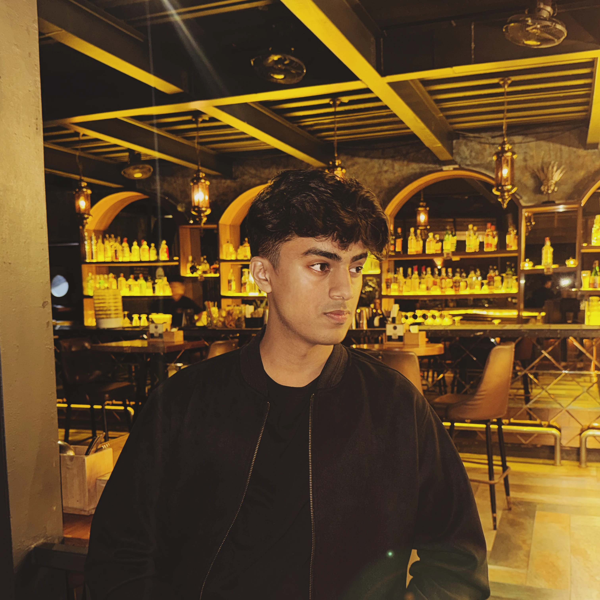

# 🌐 aradhyacp.in

<p align="center">
  
</p>

<h2 align="center">Aradhya CP | Personal Portfolio</h2>

<p align="center">
  A high-performance, visually stunning personal portfolio built with modern web technologies, featuring interactive UI components and a focus on developer experience.
</p>

<p align="center">
  
  
  
  
  
  
</p>

---

## 📖 Table of Contents
- [🚀 Overview](#-overview)
- [✨ Key Features](#-key-features)
- [🛠 Tech Stack](#-tech-stack)
- [📂 Project Structure](#-project-structure)
- [⚙️ Development & Workflow](#️-development--workflow)
- [📦 Installation & Setup](#-installation--setup)
- [🤝 Contributing](#-contributing)
- [📄 License](#-license)
- [📬 Contact](#-contact)

---

## 🚀 Overview

**aradhyacp.in** is more than just a website; it's a digital manifestation of my technical journey. Built using the latest **Next.js 15 App Router**, this project prioritizes speed, accessibility, and aesthetic appeal. It utilizes a custom design system with "glow" effects and interactive card layouts to create an immersive user experience.

The repository is maintained with strict quality standards using **Ultracite**, ensuring code consistency through Biome and ESLint.

---

## ✨ Key Features

| Feature | Description |
| :--- | :--- |
| **🎨 Advanced UI/UX** | Includes custom `BorderGlow`, `ShinyText`, and `FloatingLines` components for a modern look. |
| **💻 MacOS Style Cards** | Interactive UI elements mimicking the premium feel of MacOS interfaces. |
| **🛠 Technical Arsenal** | A dedicated section showcasing a curated list of skills and tools used. |
| **📈 GitHub Integration** | Real-time showcase of GitHub stats and open-source contributions. |
| **📱 Fully Responsive** | Seamless experience across mobile, tablet, and desktop devices. |
| **⚡ Ultra-Fast** | Optimized images (`.webp`) and minimal runtime overhead using Biome. |
| **🤖 Agentic Ready** | Includes `AGENTS.md` and `CLAUDE.md` for AI-assisted development workflows. |

---

## 🛠 Tech Stack

### Frontend & Core
<p align="left">
  
</p>

### Tooling & Quality Assurance
<p align="left">
  
</p>

**Detailed Specifications:**
- **Framework:** [Next.js 15](https://nextjs.org/) (App Router)
- **Language:** [TypeScript](https://www.typescriptlang.org/)
- **Styling:** [Tailwind CSS](https://tailwindcss.com/) + PostCSS
- **Linting/Formatting:** [Ultracite](https://github.com/ultra-cite) (Biome, ESLint, Oxlint)
- **Pre-commit Hooks:** [Husky](https://typicode.github.io/husky/)
- **Components:** Custom CSS-in-JS and Framer Motion-inspired animations.

---

## 📂 Project Structure

```bash
aradhyacp.in/
├── app/                # Next.js App Router (Pages & Layouts)
│   ├── projects/       # Projects sub-page
│   └── globals.css     # Global styles & Tailwind directives
├── components/         # Atomic Design Structure
│   ├── ui/             # Low-level UI primitives (Buttons, Cards)
│   ├── sections/       # Major page sections (Hero, About, Contact)
│   └── *.jsx/css       # Specialized animation components (BorderGlow, ShinyText)
├── lib/                # Utility functions and helper scripts
├── public/             # Static assets (pfp, icons)
├── .github/hooks/      # CI/CD & Ultracite configurations
├── .husky/             # Git hooks for code quality
├── biome.jsonc         # Biome toolchain configuration
└── components.json     # Component registry (shadcn-inspired)
```

---

## ⚙️ Development & Workflow

This project uses **Ultracite**, a zero-configuration preset for high-speed linting and formatting.

### Quality Control:
- **Biome:** Used for lightning-fast formatting and linting.
- **Husky:** Runs `.husky/pre-commit` to ensure no broken code is committed.
- **ESLint:** Secondary linting layer for specialized React/Next.js rules.

### AI-Assisted Development:
- `CLAUDE.md`: Contains project-specific instructions for the Claude AI assistant.
- `AGENTS.md`: Defines roles and memory for AI agents collaborating on the codebase.

---

## 📦 Installation & Setup

1. **Clone the Repository:**
   ```bash
   git clone https://github.com/aradhyacp/aradhyacp.in.git
   cd aradhyacp.in
   ```

2. **Install Dependencies:**
   ```bash
   npm install
   ```

3. **Run Development Server:**
   ```bash
   npm run dev
   ```
   Open [http://localhost:3000](http://localhost:3000) in your browser.

4. **Build for Production:**
   ```bash
   npm run build
   ```

---

## 🤝 Contributing

Contributions are what make the open-source community such an amazing place to learn, inspire, and create.

1. Fork the Project.
2. Create your Feature Branch (`git checkout -b feature/AmazingFeature`).
3. Commit your Changes (`git commit -m 'Add some AmazingFeature'`).
4. Push to the Branch (`git push origin feature/AmazingFeature`).
5. Open a Pull Request.

---

## 📄 License

This project is licensed under the **MIT License** - see the [LICENSE](LICENSE) file for details.

---

## 📬 Contact

**Aradhya CP**  
- **GitHub:** [@aradhyacp](https://github.com/aradhyacp)  
- **Website:** [aradhyacp.in](https://aradhyacp.in)  

---